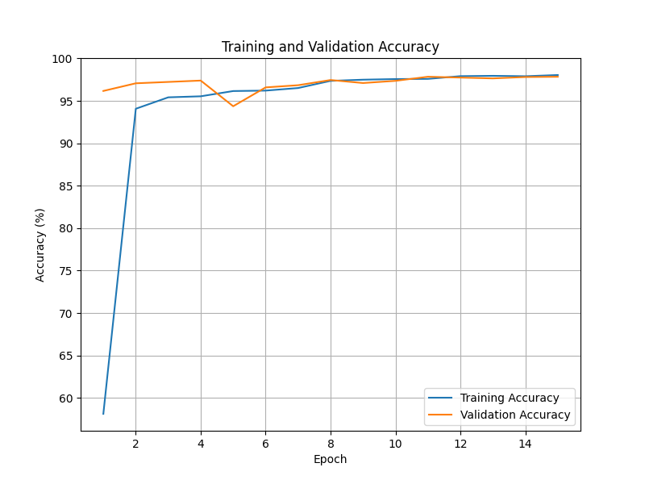
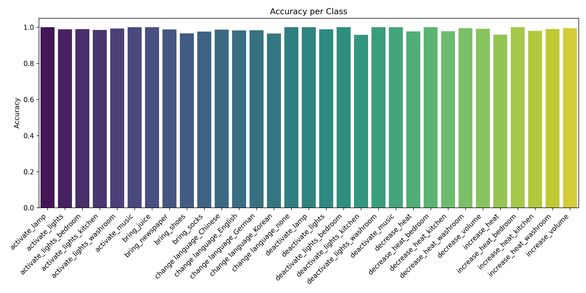
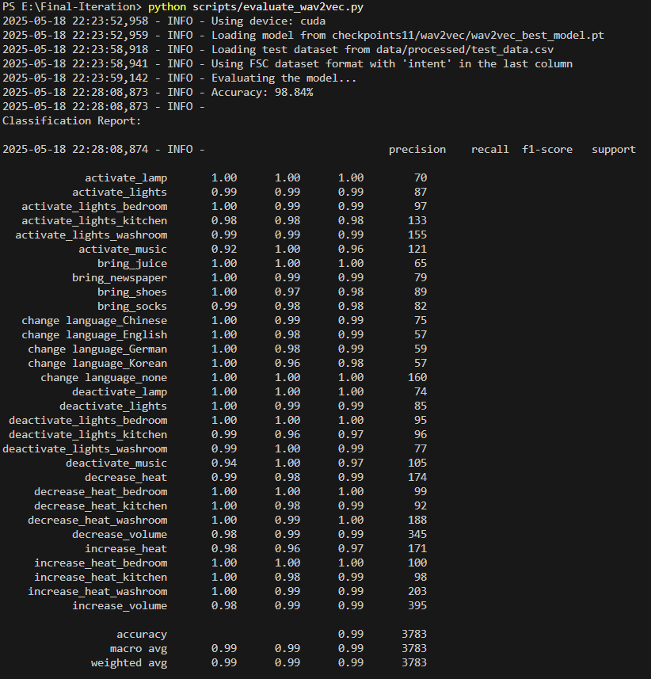

# Speech Intent Recognition System Using Wav2Vec2

[](https://huggingface.co/spaces/avi292423/Speech-Intent-Recognition)
[](https://github.com/sidgureja7803/DL_Project)
[](https://opensource.org/licenses/MIT)

A deep learning project for real-time speech intent classification using a fine-tuned Wav2Vec2.0 model. This system can understand spoken commands like "Turn off the lights" directly from raw audio, making it ideal for voice-controlled applications and smart assistants.

---

### LIVE LINK - **[Try the Live Demo on Hugging Face Spaces!](https://huggingface.co/spaces/Frizzyfreak/Speech-Intent-Recognition)*

---

##  Key Features

* **End-to-End Learning:** Classifies user intent directly from raw audio waveforms, eliminating the need for an intermediate transcription step.
* **High Accuracy:** Achieves **98.84%** accuracy on the Fluent Speech Commands dataset.
* **State-of-the-Art Model:** Built on the powerful `Wav2Vec2.0` architecture for robust speech representation.
* **Real-Time Inference:** Capable of processing microphone input for live intent prediction.
* **Interactive Web UI:** Deployed with a user-friendly Gradio interface on Hugging Face Spaces.
* **31 Command Intents:** Trained to recognize 31 unique intents for smart home and device control.

##  Methodology & Architecture

The project follows a modular deep learning pipeline, from data preparation to real-time inference. The core of the system is a `Wav2Vec2.0` model fine-tuned for the specific task of intent classification.


1.  **Data Preparation:** Audio from the Fluent Speech Commands dataset is loaded, resampled to 16kHz, and augmented.
2.  **Model Architecture:** A pre-trained `Wav2Vec2.0` model is used as the backbone. A custom classification head with Layer Normalization, an Attention mechanism, and a final Linear layer is added for intent prediction.
3.  **Training Strategy:** The model is trained using the AdamW optimizer, a dynamic learning rate scheduler, and early stopping to prevent overfitting.
4.  **Evaluation:** Performance is measured using accuracy, precision, recall, and F1-score on a held-out test set.
5.  **Real-Time Inference:** The trained model is deployed to predict intent from live microphone input.

##  Performance & Results

The model demonstrates excellent and consistent performance across all 31 intent classes.

### Training & Validation Accuracy
The model converges quickly and generalizes well, with both training and validation accuracy reaching ~98% without signs of overfitting.



### Accuracy Per Class
High accuracy is maintained across all individual classes, showcasing the model's robustness.



### Confusion Matrix
The confusion matrix shows a strong diagonal, indicating very few misclassifications between intents. Most minor confusions occur between acoustically similar commands.


### F1 Score per Class
-1 score is one of the common measures to rate how successful a classifier is. It’s the harmonic mean of two other metrics, namely: precision and recall. In a binary classification problem, the formula is:


### Accuracy Evaluation 




### Overall Performance Metrics

| Metric                  | Value  |
| ----------------------- | ------ |
| **Overall Accuracy** | 98.84% |
| Macro Average Precision | 0.99   |
| Macro Average Recall    | 0.99   |
| Macro Average F1-Score  | 0.99   |

## Getting Started

To run this project locally, follow these steps:

1.  **Clone the repository:**
    ```bash
    git clone [https://github.com/frizzyfreak/Speech-Project-Final-Iteration.git](https://github.com/frizzyfreak/Speech-Project-Final-Iteration.git)
    cd Speech-Project-Final-Iteration
    ```

2.  **Create a virtual environment:**
    ```bash
    python -m venv venv
    source venv/bin/activate  # On Windows, use `venv\Scripts\activate`
    ```

3.  **Install the dependencies:**
    ```bash
    pip install -r requirements.txt
    ```

4.  **Run the application:**
    * To test with microphone input:
        ```bash
        python test_model.py
        ```
    * To evaluate the model on the test set:
        ```bash
        python evaluate_wav2vec.py
        ```

##  Dataset

This project uses the **Fluent Speech Commands (FSC)** dataset, which contains over 30,000 English utterances designed for spoken language understanding. Each command is annotated with an `action`, `object`, and `location`. For this project, these combinations were mapped to 31 unique intent classes.

-   **Dataset Link:** [fluent.ai/fluent-speech-commands-a-dataset-for-spoken-language-understanding-research/](https://fluent.ai/fluent-speech-commands-a-dataset-for-spoken-language-understanding-research/)

## 👥 Contributors

* **Hemant Dubey** ([@frizzyfreak](https://github.com/frizzyfreak))
* **Avi Parmar** ([@avi2924](https://github.com/avi2924))
* **Siddhant Gureja** ([@sidgureja7803](https://github.com/sidgureja7803))


##  Future Work

-   Expand the model to cover a broader range of intents and languages.
-   Improve robustness in noisy environments and with multiple speakers.
-   Optimize for lower latency using techniques like model quantization.
-   Integrate with real-world APIs to execute the recognized commands (e.g., smart home APIs).

##  License

This project is licensed under the MIT License. See the [LICENSE](LICENSE) file for details.
